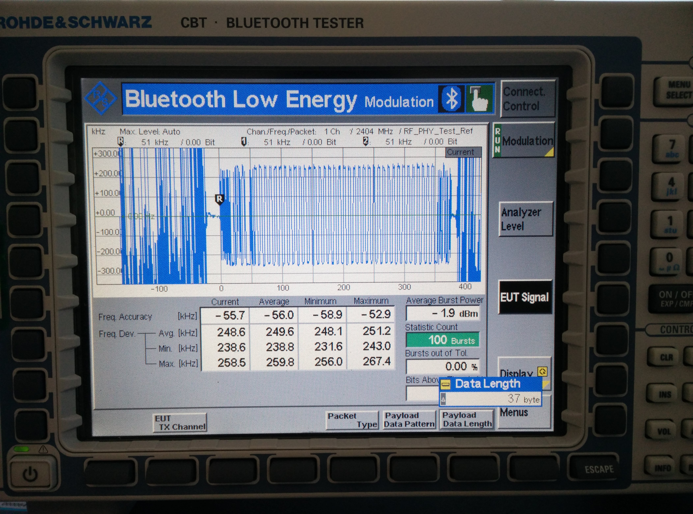

# Bluetooth Low Energy DTM decoder
---
### Have you ever wondered about software defined radio ? SDR ?

### Would you like to create a DIY  version of this on your table top ?

---
### Let's have a short look into how that is possible.

### Here is my hardware setup.
---

### There are different groups of files included in this repository.
---

### The hackrf_radio_DTM_capture folder contains RAW data of different DTM data patterns (0 through 7) at channel 4 (2410MHz) with a 20M sample rate.

---

### The Logic_Analyzer_DTM_Capture folder contains the logic analyzer data from the host that produced the radio frequency data of DTM data patterns (0 thorugh 7) at channel 4 (2410MHz).

---

---

### The BLE_DTM_Decoder.grc is the GnuRadioCompanion file that is used to experiment with the different recorded DTM capture files to decode them into hex data files for further analysis.

---

---
### The Preamble_OtherInformation text file contatins various different data such as Preamble, Access Address, Header data, Data packets, CRC information used for comparison.

---

## Youtube video presentation - click on the image below:

### Would you like to get yourself involved ? You are in luck !! There is absolutely no hardware required for this experimentation as all the RAW data have already been recorded. Install GnuRadioCompanion and try the various recorded RAW files to get different decoded hex output files.
