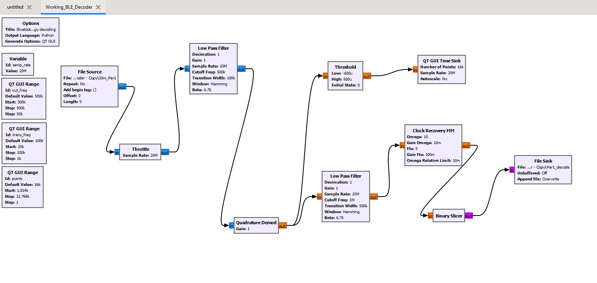
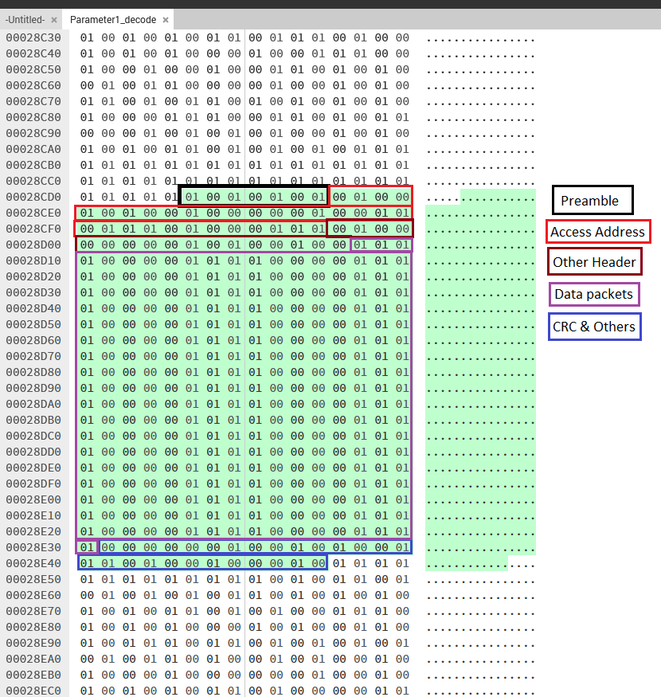
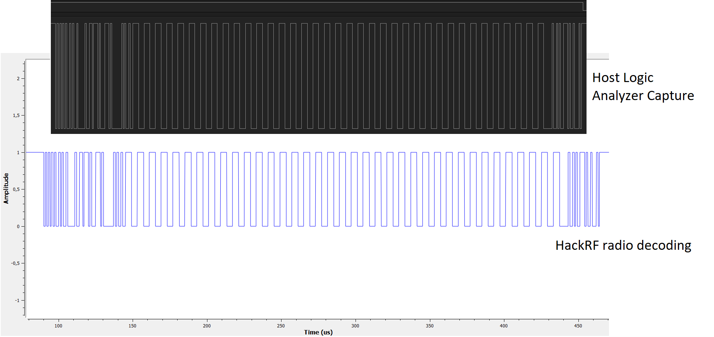

# Bluetooth Low Energy DTM decoder

---
### Accompanying blog post here : [Irshad's technical blog](https://irshad-js.github.io/posts/Experimentations_with_BLE_part_2/)

### My hardware setup.
---

### The Logic_Analyzer_DTM_Capture folder contains the logic analyzer data from the host that produced the radio frequency data of DTM data patterns (0 thorugh 7) at channel 4 (2410MHz).

---

---

### The BLE_DTM_Decoder.grc is the GnuRadioCompanion file that is used to experiment with the different recorded DTM capture files to decode them into hex data files for further analysis.

---

---
### The Preamble_OtherInformation text file contains various different data such as Preamble, Access Address, Header data, Data packets, CRC information used for comparison.

---

